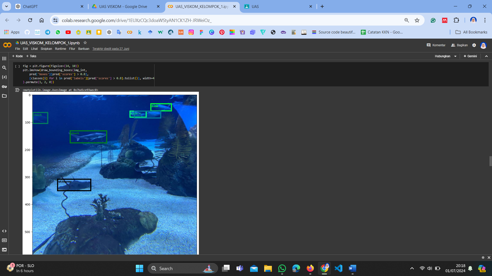
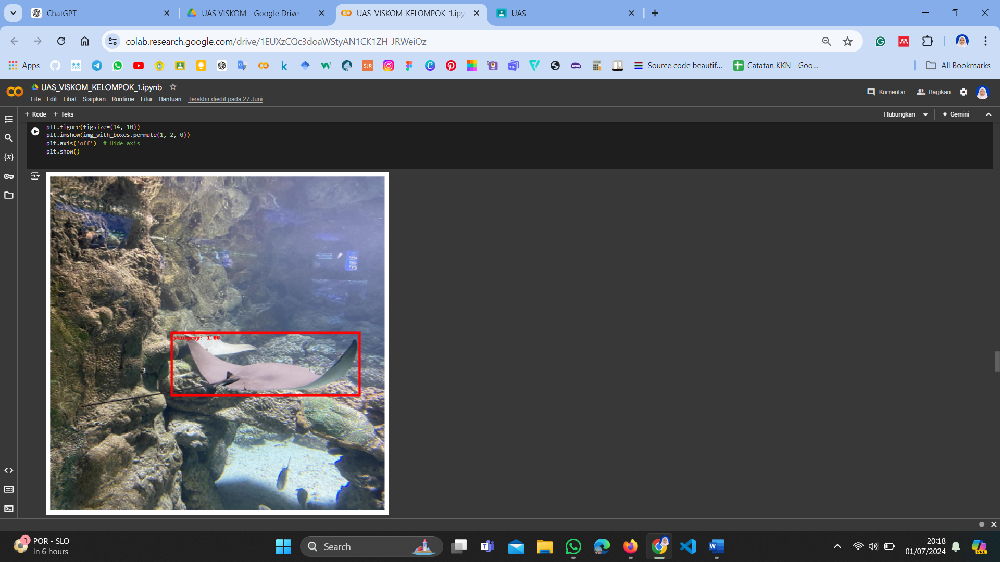
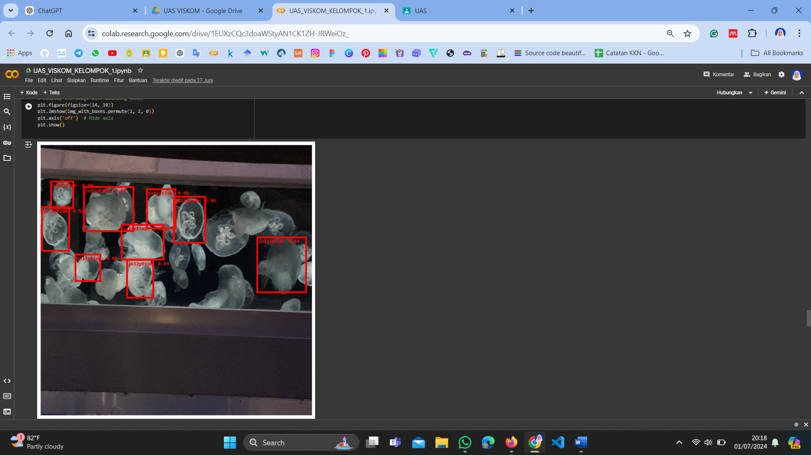

# 🐠 Implementasi Deteksi Objek Menggunakan Algoritma Faster R-CNN untuk Identifikasi Binatang Laut

---

## 📘 Deskripsi Proyek
Proyek ini mengimplementasikan **algoritma Faster R-CNN** untuk melakukan **deteksi objek binatang laut** berdasarkan citra RGB.  
Model dirancang untuk mengenali berbagai jenis hewan laut seperti **ikan, ubur-ubur, penguin, puffin, hiu, bintang laut, dan pari** menggunakan dataset *Aquarium Dataset* dari Kaggle.

Model dikembangkan menggunakan **PyTorch** dengan *backbone* **MobileNetV3 Large FPN**, serta dilakukan **augmentasi data** untuk meningkatkan generalisasi model.

---

## 🧠 Metodologi

### 📂 Dataset
- Dataset: **Aquarium Dataset (Kaggle)**  
- Jumlah gambar: **512 citra**  
- Kelas objek:
  - 🐟 **Fish**
  - 🪼 **Jellyfish**
  - 🐧 **Penguin**
  - 🐦 **Puffin**
  - 🦈 **Shark**
  - ⭐ **Starfish**
  - 🐡 **Stingray**
- Split data: 70% train, 20% validasi, 10% testing

---

### ⚙️ Arsitektur Model
Model menggunakan **Faster R-CNN** dengan dua tahap utama:
1. **Region Proposal Network (RPN)** – menghasilkan area kandidat objek  
2. **Fast R-CNN Head** – melakukan klasifikasi & regresi *bounding box*  

Backbone yang digunakan adalah **MobileNetV3 Large FPN** untuk ekstraksi fitur ringan dan efisien.

---

### 🔧 Parameter Pelatihan
| Parameter | Nilai |
|------------|--------|
| Epoch | 10 |
| Batch Size | 4 |
| Optimizer | SGD |
| Learning Rate | 0.005 |
| Backbone | MobileNetV3 Large FPN |
| Metric | Mean Average Precision (mAP) |

---

## 📊 Hasil dan Pembahasan

### 📈 Hasil Evaluasi
Model diuji menggunakan metrik **Mean Average Precision (mAP)** dengan hasil:
- **mAP = 0.0002**  
Walaupun nilai mAP masih rendah, model menunjukkan kemampuan mengenali bentuk dan pola warna objek laut secara visual.

---

## 📸 Hasil Deteksi Objek

Berikut beberapa hasil deteksi model pada dataset pengujian:

---

---

---

🔍 Setiap *bounding box* menunjukkan area objek terdeteksi dengan label kelas dan nilai confidence.  
Model mampu mendeteksi bentuk objek secara cukup baik, meskipun akurasi klasifikasi masih perlu peningkatan.

---

## 🧩 Tools & Library
- **Python 3.10**
- **PyTorch**
- **OpenCV**
- **Albumentations**
- **Matplotlib**
- **Pandas**, **NumPy**
- **COCO API (pycocotools)**

---

## 💡 Kesimpulan
- Implementasi **Faster R-CNN + MobileNetV3 FPN** berhasil mendeteksi objek binatang laut pada dataset *Aquarium*.  
- Masih diperlukan peningkatan performa model dengan:
  - Menambah variasi dataset  
  - Fine-tuning hyperparameter  
  - Menggunakan backbone yang lebih kompleks seperti ResNet50  
